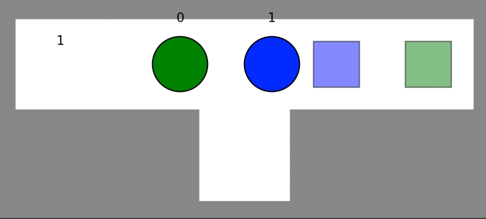
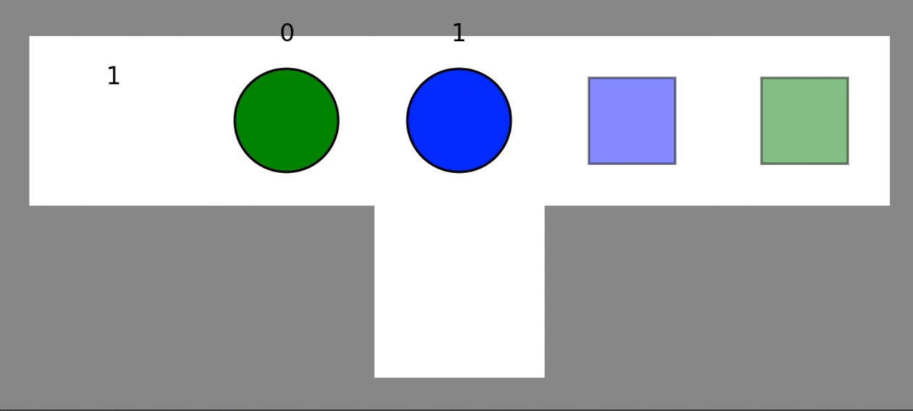
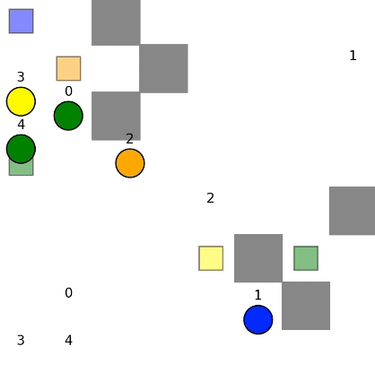

# Multi-Agent Path Finding in Python

The Multi-Agent Pathfinding (MAPF) problem involves determining collision-free paths for a group of agents that need to navigate through a shared environment to reach their respective goal locations. The objective is to find a set of paths for all agents such that they avoid collisions with each other while reaching their individual destinations.

Key characteristics of the Multi-Agent Pathfinding problem include:

- Multiple Agents: There are two or more agents present in the environment, each with a unique starting location and a specific destination or goal.

- Shared Environment: The agents navigate through a common environment where they might encounter each other. The challenge is to plan their paths to avoid collisions.

- Collision Avoidance: The primary goal is to find a set of paths for the agents that prevent them from colliding with each other. Paths must be coordinated to ensure safe and efficient movement.

- Optimality: In many cases, the objective is to find optimal or near-optimal paths that minimize some criteria, such as the total travel time, the total distance covered, or other relevant metrics.

## Introduction

This repository consists of the implementation of some multi-agent path-planning algorithms in Python. The following algorithms are currently implemented:

- [Introduction](#introduction)
- [Dependencies](#dependencies)
- [A\*](#a-*)
- [Prioritized Planning](#prioritized-planning)
- [Conflict Based Search](#conflict-based-search)
- [Conflict Based Search with Disjoint Splitting](#conflict-based-search-with-disjoint-splitting)

## Dependencies

Install the necessary dependencies by running.

```shell
python3 -m pip install -r requirements.txt
```

## A\*

The Independent MAPF solver finds paths for each agents at the same time, however collide can occur.

#### Execution

```
python run_experiments.py --instance instances/exp2_1.txt --solver Independent
```

#### Results sample



## Prioritized Planning

The prioritized MAPF solver finds paths for all agents, one after the other, that do not collide with the environment or the already planned paths of the other agents. However, it might not complete and optimal.

#### Execution

```
python run_experiments.py --instance instances/exp2_1.txt --solver Prioritized
```

#### Results sample



## Conflict Based Search

Conflict-Based Search (CBS) is slower than prioritized planning but complete and optimal.

#### Execution

```
python run_experiments.py --instance "instances/test_*" --solver CBS --batch
```

The batch command generates a results file named results.csv, to compare it with the one available in instances/min-sum-of-cost.csv.

#### Result sample



## Conflict Based Search with Disjoint Splitting

The main difference between Conflict-Based Search (CBS) and Conflict Based Search with Disjoint Splitting (CBS-DS) lies in the high-level search strategy. CBS addresses conflicts for all agents collectively, while CBS-DS introduces disjoint splitting to address conflicts independently in disjoint groups. The choice between CBS and CBS-DS may depend on the specific characteristics of the MAPF instance and the desired trade-offs between solution quality and computational efficiency. CBS-DS is designed to exploit structure in the MAPF problem to improve scalability and reduce computational complexity.

#### Execution

```
python run_experiments.py --instance instances/exp4.txt --solver CBS
```

#### Result sample

### Note

To find other scene situation, look into `instances/` folder and replace `[scene_to_test]` with the desired scene.

```
python run_experiments.py --instance instances/[scene_to_test].txt --solver CBS
```

### References

[J. Li, D. Harabor, P. Stuckey, A. Felner, H. Ma, and S. Koenig. Disjoint splitting for multi- agent path finding with conflict-based search. In Proceedings of the International Conference on Automated Planning and Scheduling, pages 279-283, 2019.](https://ojs.aaai.org/index.php/ICAPS/article/view/3487)
